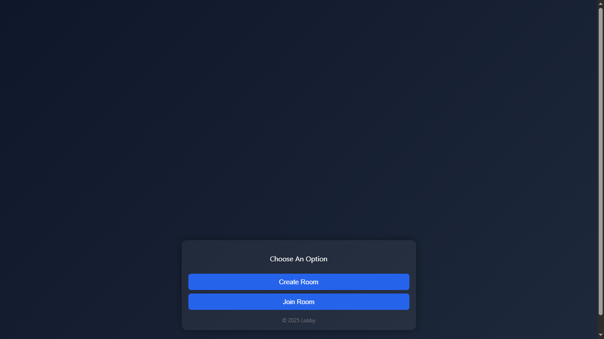
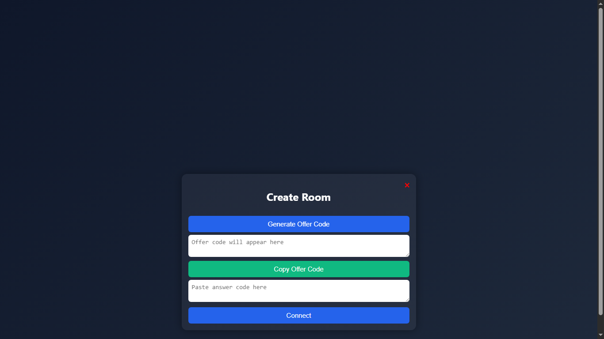
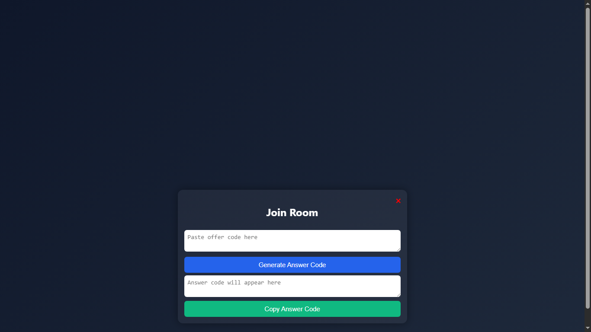
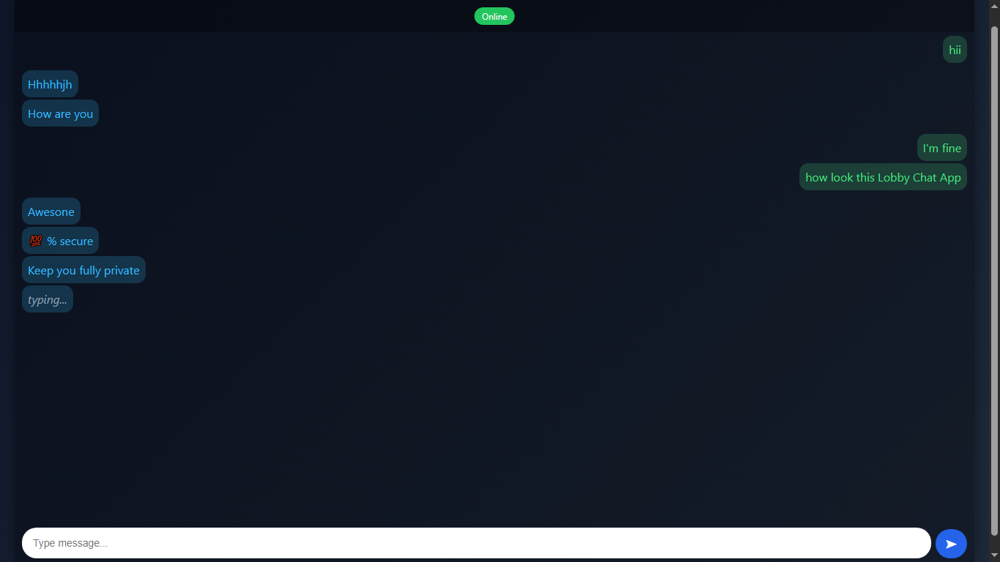
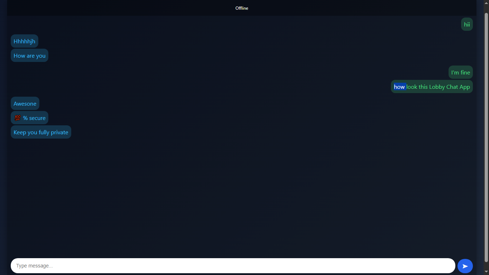

# 💬 Lobby Chat App (WebRTC)

A simple peer-to-peer chat application built with **WebRTC** and vanilla **HTML, CSS, and JavaScript**.  
No central server is required for messaging — connections are established directly between peers using copy-paste offer/answer codes.

---

## 🚀 Features
- 🔗 Peer-to-peer messaging (WebRTC DataChannel)
- 🎨 Clean responsive UI
- 📋 Copy-paste room codes (no backend required)
- 👀 Typing indicator
- 🔴 Online/Offline badge
- 📱 Mobile-friendly
- ⚡ Lightweight (pure JS, no external libraries)

---

## 🛠️ How It Works
1. One user clicks **Create Room** → generates an **offer code**.
2. The other user clicks **Join Room** → pastes the offer and generates an **answer code**.
3. The first user pastes the **answer code** and clicks **Connect**.
4. 🎉 The chat is established (direct peer-to-peer connection).

---

## 📷 Screenshots

### Home Screen 

##
### Create Room 

##
### Join Room 

##
### Chat Room : Online

##
### Chat Room : Offline

---

## 🌍 Live Demo
Try it here: [Lobby App Demo](https://surajchaurasia84.github.io/Lobby/)

---

## 📋 Requirements
- A modern browser (Chrome, Edge, Firefox)  
- Both users must be online at the same time  
- Copy-paste of offer/answer codes between peers  

---

## 🚧 Limitations
- Requires manual copy-paste of codes (no signaling server yet)  
- Only text messages supported (no file/image sharing yet)  
- Peers must stay online during the session  

---

## 🔮 Future Plans
- Add signaling server to remove copy-paste codes  
- Add user authentication & chat rooms  
- Support for file & image sharing
- Try to add real time video confrencing  
- Improve mobile UX  

---

## ⭐ Support
If you like this project, give it a ⭐ on GitHub to support it!
